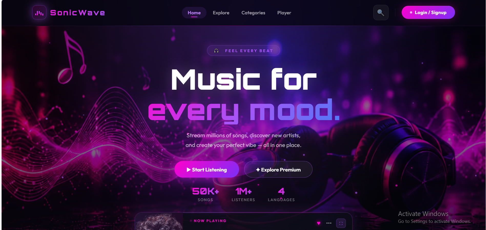
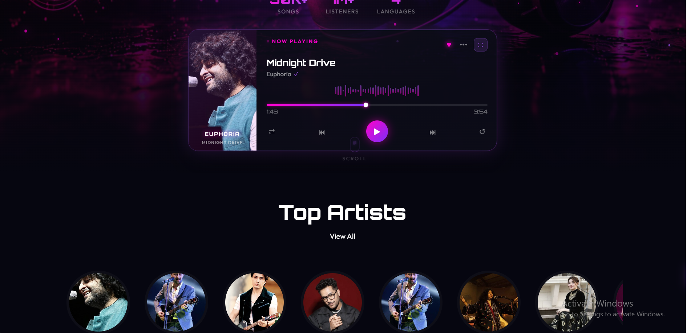
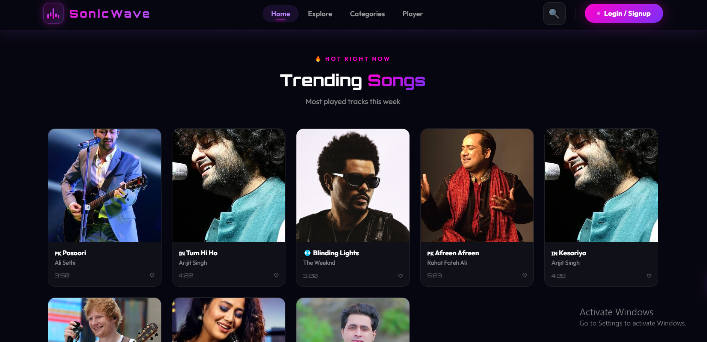

# 🎵 SonicWave

SonicWave is a premium music streaming web application that delivers high-quality audio with a stunning, modern user interface. Designed to cater to every mood, SonicWave brings your favorite tracks, dynamic playlists, and fresh genres right to your fingertips.

## 📸 Screenshots

  

  

  

## ✨ Features

- **Modern UI/UX:** A visually striking dark-themed interface with vibrant gradient accents, glassmorphism elements, and smooth micro-animations.
- **Responsive Design:** Fully responsive layout that looks great on desktops, tablets, and mobile devices.
- **Music Player:** Fully functional audio player with play, pause, progress tracking, and volume control capabilities.
- **User Authentication:** Beautiful login and registration pages for user onboarding.
- **Categorized Discovery:** Explore music by genres, moods, and top charts via the dedicated Explore and Categories pages.
- **Interactive Elements:** Engaging hover states, animated backgrounds, and dynamic particle effects for a premium feel.

## 📂 Project Structure

- `index.html` - The main landing page with hero sections and featured content.
- `player.html` - The dedicated music player interface.
- `explore.html` / `categories.html` - Pages for discovering new music and browsing genres.
- `login.html` / `register.html` - User authentication forms.
- `about.html` / `contact.html` - Information about SonicWave and contact details.
- `css/` - Contains the main stylesheets defining the design system, animations, and responsive layouts.
- `js/` - JavaScript files for interactive functionality and audio playback logic.
- `images/` - Image assets used across the application.
- `songs/` - Directory containing the audio files.

## 🚀 Getting Started

To view and interact with SonicWave locally:

1. **Clone or Download** this repository to your local machine.
2. **Open the Project:** Navigate to the project directory.
3. **Launch the App:** Simply open `index.html` in your preferred modern web browser (e.g., Chrome, Firefox, Safari). No build tools or local servers are strictly required for the basic frontend viewing, though using a local server (like Live Server in VS Code) is recommended for the best experience.

## 🎨 Tech Stack

- **HTML5:** Semantic structuring of the application.
- **CSS3:** Custom styling featuring CSS variables, Flexbox/Grid layouts, and keyframe animations.
- **JavaScript (Vanilla):** DOM manipulation, audio player controls, and dynamic interactivity.
- **Fonts:** Integration with Google Fonts (Outfit & Orbitron) for modern typography.

## 🤝 Contributing

Contributions, issues, and feature requests are welcome! Feel free to check the issues page if you want to contribute.

## 📝 License

This project is open-source and available under the [MIT License](LICENSE).
